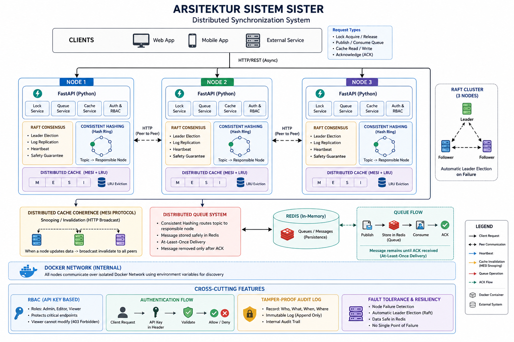

# 🔐 Distributed Synchronization System

> Tugas 2 — Sistem Parallel dan Terdistribusi  
> Implementasi sistem sinkronisasi terdistribusi dengan Raft Consensus, Consistent Hashing, dan MESI Protocol menggunakan Python & Docker.

[](https://python.org)
[](https://fastapi.tiangolo.com)
[](https://docker.com)
[](#testing)
[](LICENSE)

---

## 🎬 Video Demonstrasi

> 📺 **[Tonton di YouTube → https://youtu.be/rrKOlAeSnCo](https://youtu.be/rrKOlAeSnCo)**

---

## 📋 Daftar Isi

- [Arsitektur Sistem](#-arsitektur-sistem)
- [Fitur Utama](#-fitur-utama)
- [Tech Stack](#-tech-stack)
- [Struktur Project](#-struktur-project)
- [Quick Start](#-quick-start)
- [API Reference](#-api-reference)
- [Testing](#-testing)
- [Performance Benchmarking](#-performance-benchmarking)
- [Bonus Features](#-bonus-features)

---

## 🏗️ Arsitektur Sistem

Sistem ini terdiri dari **3 Node Server independen** dan **1 Redis** sebagai shared state, semuanya berjalan dalam container Docker terpisah dan berkomunikasi via HTTP.



Setiap Node menjalankan **FastAPI server** yang berperan sebagai:
- Public interface untuk client
- Internal communication interface antar node (Raft, Bus snooping, Queue routing)

---

## ✨ Fitur Utama

### 🔐 A. Distributed Lock Manager (Raft Consensus)
- Implementasi algoritma **Raft Consensus dari nol** untuk leader election
- Support **Exclusive Lock** (satu client) dan **Shared Lock** (multi client)
- **Re-entrant lock** dengan TTL renewal otomatis
- **Log Replication**: semua perintah lock melewati Leader dan di-commit ke mayoritas node
- Auto-cleanup lock yang kadaluwarsa (TTL-based)

### 📨 B. Distributed Queue (Consistent Hashing)
- **Consistent Hashing Ring** dengan virtual nodes untuk distribusi merata
- **Automatic routing**: request ke node manapun diarahkan ke node yang bertanggung jawab
- **At-Least-Once delivery** dengan mekanisme processing list di Redis
- Support multiple producers dan consumers lintas node
- Background task untuk recovery pesan yang tidak di-ACK

### 🧠 C. Cache Coherence (Protokol MESI)
- Implementasi lengkap **MESI Protocol** (Modified, Exclusive, Shared, Invalid)
- **Bus Snooping**: setiap write di-broadcast ke semua peer via HTTP
- **LRU Eviction Policy** menggunakan `OrderedDict`
- **Write-back policy**: data Modified di-flush ke Redis saat eviction
- Real-time metrics (hits, misses, evictions, bus messages)

### 🐳 D. Containerization
- **Dockerfile** multi-stage untuk setiap node
- **Docker Compose** orchestration dengan health check
- **Environment-based configuration** via `.env` files
- Redis dengan AOF persistence

---

## 🛠️ Tech Stack

| Komponen | Teknologi |
|----------|-----------|
| Web Framework | FastAPI + Uvicorn |
| Async HTTP Client | HTTPX |
| Distributed State | Redis 7 |
| Containerization | Docker & Docker Compose |
| Load Testing | Locust |
| Unit Testing | Pytest + pytest-asyncio |
| Data Validation | Pydantic v2 |

---

## 📁 Struktur Project

```
distributed-sync-system/
├── src/
│   ├── nodes/
│   │   ├── base_node.py        # FastAPI app factory & route definitions
│   │   ├── lock_manager.py     # Distributed lock state machine
│   │   ├── queue_node.py       # Queue producer/consumer logic
│   │   └── cache_node.py       # MESI cache manager
│   ├── consensus/
│   │   └── raft.py             # Raft algorithm (leader election + log replication)
│   ├── communication/          # Inter-node HTTP helpers
│   └── utils/
│       ├── config.py           # Pydantic settings (env-based)
│       ├── hash_ring.py        # Consistent hashing ring
│       └── security.py         # RBAC + audit logging
├── tests/
│   ├── unit/
│   │   ├── test_hash_ring.py   # 3 tests
│   │   ├── test_lock_state.py  # 13 tests
│   │   ├── test_cache_manager.py # 14 tests
│   │   ├── test_raft_node.py   # 13 tests
│   │   └── test_security.py    # 11 tests (+ 3 existing = 62 total)
│   ├── integration/
│   └── performance/
├── docker/
│   └── Dockerfile.node
├── docs/
│   ├── architecture.md
│   └── api_spec.yaml
├── benchmarks/
│   └── load_test_scenarios.py
├── docker-compose.yml
├── requirements.txt
├── pytest.ini
├── conftest.py
├── .env.example
└── README.md
```

---

## 🚀 Quick Start

### Prasyarat
- [Docker Desktop](https://www.docker.com/products/docker-desktop/) (v20+)
- [Docker Compose](https://docs.docker.com/compose/) (sudah termasuk di Docker Desktop)

### 1. Clone Repository
```bash
git clone https://github.com/oliviadafina/distributed-sync-system.git
cd distributed-sync-system
```

### 2. Jalankan Sistem
```bash
docker-compose up --build
```

Tunggu hingga semua container berstatus **healthy** (sekitar 10-15 detik). Output terminal akan menunjukkan log Raft election berlangsung.

### 3. Verifikasi Sistem Berjalan
Buka browser dan akses Swagger UI di tiga node:

| Node | URL | Status |
|------|-----|--------|
| Node 1 | http://localhost:8001/docs | Follower/Leader |
| Node 2 | http://localhost:8002/docs | Follower/Leader |
| Node 3 | http://localhost:8003/docs | Follower/Leader |

Cek siapa Leader:
```bash
curl http://localhost:8001/health
curl http://localhost:8002/health
curl http://localhost:8003/health
```

---

## 📡 API Reference

> Dokumentasi lengkap tersedia di `docs/api_spec.yaml` (OpenAPI 3.0)  
> Atau akses interaktif via Swagger UI: `http://localhost:800X/docs`

### Autentikasi (Fitur Bonus RBAC)
Semua endpoint memerlukan header `X-API-Key`:

| Role | API Key | Akses |
|------|---------|-------|
| Admin | `admin-secret-key-123` | Full access (acquire, release, write) |
| Viewer | `viewer-secret-key-456` | Read-only (health, poll, read cache) |

Di Swagger UI: klik tombol **Authorize** → masukkan API Key → **Close**.

---

### 🔐 Distributed Lock

#### Acquire Lock
```http
POST /lock/acquire
X-API-Key: admin-secret-key-123
Content-Type: application/json

{
  "resource": "database_master",
  "client_id": "client_A",
  "type": "exclusive",
  "timeout": 10,
  "ttl": 300
}
```
> ⚠️ Harus dikirim ke **node Leader**. Non-leader akan menolak dengan `{"message": "Not leader"}`.

#### Release Lock
```http
POST /lock/release
X-API-Key: admin-secret-key-123
Content-Type: application/json

{
  "resource": "database_master",
  "client_id": "client_A"
}
```

---

### 📨 Distributed Queue

#### Publish Message
```http
POST /queue/publish
X-API-Key: admin-secret-key-123
Content-Type: application/json

{
  "topic": "pesanan",
  "payload": {
    "item": "Laptop ROG",
    "jumlah": 2
  }
}
```
> Node manapun bisa menerima publish — akan di-route otomatis ke node yang bertanggung jawab via Consistent Hashing.

#### Poll Message
```http
GET /queue/poll/{topic}
X-API-Key: viewer-secret-key-456
```

#### Acknowledge Message
```http
POST /queue/ack/{topic}/{message_id}
X-API-Key: admin-secret-key-123
```

---

### 🧠 Distributed Cache

#### Write Cache
```http
POST /cache/{key}
X-API-Key: admin-secret-key-123
Content-Type: application/json

{
  "value": "50000000"
}
```

#### Read Cache
```http
GET /cache/{key}
X-API-Key: viewer-secret-key-456
```

#### Cache Metrics
```http
GET /cache/metrics
X-API-Key: viewer-secret-key-456
```

---

## 🧪 Testing

### Menjalankan Unit Tests (Tanpa Docker)

Install dependencies terlebih dahulu:
```bash
pip install -r requirements.txt
```

Jalankan semua unit tests:
```bash
python -m pytest tests/unit/ -v
```

**Hasil yang diharapkan:**
```
============================= test session starts ==============================
collected 62 items

tests/unit/test_cache_manager.py  ................  [ 22%]
tests/unit/test_hash_ring.py      ...              [ 27%]
tests/unit/test_lock_state.py     .............    [ 48%]
tests/unit/test_raft_node.py      .............    [ 69%]
tests/unit/test_security.py       ...........      [100%]

======================= 62 passed in 4.87s ==============================
```

### Ringkasan Test Coverage

| Modul | File Test | Jumlah Test | Coverage |
|-------|-----------|-------------|---------|
| Consistent Hashing | `test_hash_ring.py` | 3 | Init, distribusi, add/remove node |
| Lock State Machine | `test_lock_state.py` | 13 | Exclusive, shared, TTL, re-entrant |
| MESI Cache | `test_cache_manager.py` | 14 | States, LRU eviction, metrics, snoop |
| Raft Consensus | `test_raft_node.py` | 13 | Election, AppendEntries, log replication |
| Security RBAC | `test_security.py` | 11 | API keys, roles, audit log |
| **Total** | | **62** | **All passed ✅** |

---

## 📊 Performance Benchmarking

### Menjalankan Load Test (Locust)

> Pastikan sistem sudah berjalan via `docker-compose up`

```bash
# Install locust jika belum
pip install locust

# Jalankan Locust
locust -f benchmarks/load_test_scenarios.py
```

Buka Locust UI di `http://localhost:8089` lalu konfigurasikan:
- **Number of users**: 100
- **Ramp up (users/sec)**: 10
- **Host**: `http://localhost:8001` (atau port node Leader)

Klik **Start Swarming** dan pantau grafik **Charts**.

### Hasil Benchmark (Referensi)

| Metrik | Hasil |
|--------|-------|
| Throughput | ~200+ RPS (stable) |
| Error Rate | 0% (saat steady state) |
| Lock Acquire P99 | < 50ms |
| Cache Read (hit) | < 5ms |
| Raft Election Recovery | < 3 detik |

> Lonjakan response time sesaat terjadi saat Raft election berlangsung — ini bukan error, ini **Self-Healing Distributed System** bekerja.

---

## 🎁 Bonus Features

### ✅ Pilihan D: Security & Encryption (+5 poin)

| Fitur | Implementasi |
|-------|-------------|
| **RBAC** | Role-based API Key (`admin` / `viewer`) via `X-API-Key` header |
| **Audit Logging** | Setiap aksi penting dicatat ke `security_audit.log` (append-only) |
| **401/403 Enforcement** | Missing key → 401, invalid key → 403, insufficient role → 403 |

---

## ⚙️ Konfigurasi Environment

Salin `.env.example` menjadi `.env` dan sesuaikan:

```bash
cp .env.example .env
```

| Variable | Default | Keterangan |
|----------|---------|------------|
| `NODE_ID` | `node_1` | Identifier unik node |
| `NODE_PORT` | `8000` | Port internal node |
| `PEERS` | _(kosong)_ | URL peer dipisah koma |
| `REDIS_HOST` | `redis` | Hostname Redis |
| `REDIS_PORT` | `6379` | Port Redis |
| `ELECTION_TIMEOUT_MIN` | `1500` | Min timeout Raft election (ms) |
| `ELECTION_TIMEOUT_MAX` | `3000` | Max timeout Raft election (ms) |
| `HEARTBEAT_INTERVAL` | `500` | Interval heartbeat Leader (ms) |

---

## 🛑 Menghentikan Sistem

```bash
# Hentikan semua container
docker-compose down

# Hentikan dan hapus volume (reset Redis data)
docker-compose down -v
```

---

## 📚 Referensi

- [Raft Consensus Algorithm Paper](https://raft.github.io/raft.pdf) — Ongaro & Ousterhout, 2014
- [Redis Documentation](https://redis.io/docs/)
- [FastAPI Documentation](https://fastapi.tiangolo.com/)
- [Consistent Hashing](https://en.wikipedia.org/wiki/Consistent_hashing)
- [MESI Protocol](https://en.wikipedia.org/wiki/MESI_protocol)

---
