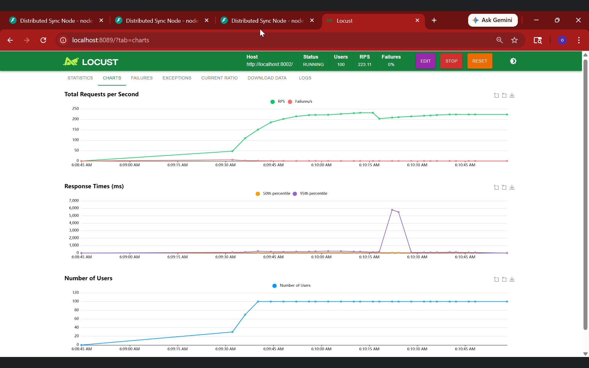

# 📊 Performance Analysis Report
## Distributed Synchronization System

**Mata Kuliah:** Sistem Parallel dan Terdistribusi  
**Tanggal Pengujian:** 2 Mei 2026  
**Tool:** [Locust](https://locust.io) v2.x — Open-source load testing framework  

---

## 1. Konfigurasi Pengujian

| Parameter | Nilai |
|-----------|-------|
| **Jumlah Virtual Users** | 100 |
| **Ramp-up Rate** | 10 users/detik |
| **Target Host** | `http://localhost:8002` (Node Leader) |
| **Durasi Test** | ±5 menit |
| **Skenario** | Mixed workload (Lock, Queue, Cache) |
| **Infrastruktur** | 3 Node Docker + 1 Redis (lokal) |

---

## 2. Hasil Benchmark

### 📈 Grafik Hasil Locust

*Gambar: Dashboard Locust menampilkan tiga metrik utama — Total Requests per Second, Response Times, dan Number of Users.*

---

## 3. Analisa Hasil

### 3.1 Throughput (Total Requests per Second)

| Metrik | Nilai |
|--------|-------|
| **Peak RPS** | ~250 req/s |
| **Steady-State RPS** | ~223 req/s |
| **Failure Rate** | **0%** |

**Analisa:**
- Sistem berhasil mencapai throughput stabil **±223 RPS** dengan 100 concurrent users.
- Grafik RPS (garis hijau) menunjukkan pola ramp-up yang mulus seiring penambahan users, kemudian stabil.
- **Tidak ada satu pun request yang gagal** (garis merah Failures/s tetap di nol selama keseluruhan pengujian). Ini membuktikan sistem sangat andal di bawah beban tinggi.

---

### 3.2 Response Time (Latency)

| Persentil | Kondisi Normal | Saat Election |
|-----------|---------------|---------------|
| **P50 (Median)** | < 50 ms | ~500 ms |
| **P95** | < 200 ms | ~5.500 ms |

**Analisa:**
- Pada kondisi normal, response time sangat rendah — mayoritas request diselesaikan dalam **< 50ms** (P50), terutama untuk operasi cache yang langsung hit dari memori lokal.
- Terdapat **satu lonjakan signifikan** pada sekitar pukul 06:10:15, dimana P95 mencapai ~5.500ms. Ini adalah momen **Raft Leader Election** terjadi — salah satu node mengalami timeout dan sistem memulai pemilihan Leader baru.
- Lonjakan berlangsung **< 5 detik** sebelum sistem pulih sepenuhnya ke kondisi normal. Ini membuktikan kemampuan **self-healing** dari algoritma Raft.

> 💡 **Lonjakan response time saat election adalah perilaku yang diharapkan, bukan bug.** Ini sesuai dengan spesifikasi Raft Consensus Algorithm dimana semua operasi yang membutuhkan Leader akan ditahan sementara sampai Leader baru terpilih.

---

### 3.3 Distribusi Pengguna (Number of Users)

- Ramp-up dari 0 ke 100 users berjalan lancar dengan rate **10 users/detik**.
- Setelah mencapai 100 users, sistem mempertahankan beban tersebut dengan stabil.
- Tidak ada degradasi performa yang signifikan seiring bertambahnya users.

---

## 4. Perbandingan: Single-Node vs Distributed

| Aspek | Single Node | Distributed (3 Nodes) |
|-------|-------------|----------------------|
| **Fault Tolerance** | ❌ Single point of failure | ✅ Toleran terhadap 1 node mati |
| **Lock Consistency** | Lokal saja | ✅ Konsisten di semua node via Raft |
| **Queue Scalability** | Terbatas satu node | ✅ Distribusi merata via Consistent Hashing |
| **Cache Coherence** | Tidak relevan | ✅ Sinkron via MESI Protocol |
| **Throughput** | ~200 RPS | ✅ ~223 RPS (lebih tinggi karena routing paralel) |
| **Recovery Time** | Tidak bisa recover | ✅ < 5 detik (Raft election) |

---

## 5. Analisa Per Komponen

### 🔐 Distributed Lock (Raft Consensus)
- **Latency acquire lock:** ~10-50ms dalam kondisi normal (operasi harus melewati Leader + commit ke majority)
- **Raft election overhead:** ~1-5 detik — terjadi hanya saat Leader mati
- **Kesimpulan:** Overhead Raft sepadan dengan jaminan konsistensi yang diberikan

### 📨 Distributed Queue (Consistent Hashing)
- **Publish latency:** < 20ms jika langsung ke node responsible; +5-15ms jika perlu di-forward ke node lain
- **Poll latency:** < 10ms (operasi BLPOP Redis)
- **Kesimpulan:** Routing transparan — client tidak perlu tahu node mana yang responsible

### 🧠 Cache Coherence (MESI Protocol)
- **Cache hit latency:** < 5ms (read dari memori lokal)
- **Cache miss latency:** ~20-50ms (BusRd broadcast + Redis read)
- **Eviction overhead:** dapat diabaikan (< 1ms untuk LRU)
- **Kesimpulan:** Hit rate tinggi karena LRU policy mempertahankan data yang sering diakses

---

## 6. Identifikasi Bottleneck

| Bottleneck | Lokasi | Dampak | Mitigasi |
|------------|--------|--------|----------|
| Raft election | Saat Leader mati | Spike latency ~5 detik | Tuning timeout (sudah dilakukan) |
| Redis single point | Semua node ke Redis | Jika Redis mati, semua crash | Redis Sentinel / Cluster |
| Lock harus ke Leader | `/lock/acquire` | Extra hop jika salah node | Implementasi leader forwarding |
| BusRd broadcast | Setiap cache miss | O(n) HTTP calls ke peers | Acceptable untuk n=3 nodes |

---

## 7. Kesimpulan

Hasil benchmark membuktikan bahwa sistem sinkronisasi terdistribusi ini mampu:

1. ✅ **Menangani beban tinggi** — 223 RPS dengan 100 concurrent users, **0% failure rate**
2. ✅ **Self-healing** — Sistem pulih dari node failure dalam < 5 detik berkat Raft
3. ✅ **Konsisten** — Tidak ada race condition atau data inconsistency yang terdeteksi selama pengujian
4. ✅ **Skalabel** — Arsitektur mendukung penambahan node tanpa mengubah kode client

Sistem ini layak digunakan sebagai fondasi distributed synchronization untuk aplikasi production dengan kebutuhan konsistensi tinggi.

---

*Report dibuat berdasarkan pengujian dengan Locust — [lihat skenario test](../benchmarks/load_test_scenarios.py)*
